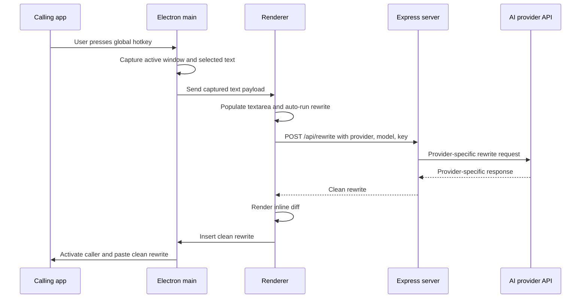

# Architecture

Fix My Text is a compact Electron desktop app wrapped around a local Express server and a single-page renderer. The app is feature complete for its core loop: capture selected text, rewrite it conservatively with an AI provider, show an inline diff, and copy or insert the clean rewrite.

## Goals

- Capture selected text from another desktop app.
- Rewrite the text conservatively through Anthropic, OpenAI, or Grok/xAI.
- Show the user an inline tracked-changes-style diff.
- Copy or insert the clean rewrite without displaying a separate clean-output panel.
- Keep the desktop window small enough to feel like a utility popup.

## Components

### Renderer: `index.html`

The renderer owns the visible workflow:

- Provider, API key, model, and hotkey settings.
- Source textarea.
- Rewrite button state.
- Word-level inline diff rendering.
- Copy and Insert buttons.
- Dynamic content-height measurement for native window resizing.

The renderer keeps the clean rewrite in memory as `lastRewrite`. The user sees the diff, but Copy and Insert use the clean rewrite.

### Main Process: `main.js`

The Electron main process owns desktop integration:

- Starts the local Express app.
- Creates and reveals the BrowserWindow.
- Registers the saved global hotkey on startup.
- Captures selected text when the hotkey fires.
- Remembers the calling app/window for Insert.
- Inserts the clean rewrite back into the calling app on supported platforms.
- Resizes the native window when the renderer reports content height.

### Preload Bridge: `preload.js`

The preload script exposes a narrow `window.fixMyTextDesktop` API:

- `getConfig()`
- `setHotkey(accelerator)`
- `setSettingsState(state)`
- `insertRewrite(text)`
- `resizeToContent(height)`
- `onConfig(callback)`
- `onHotkeyActivated(callback)`
- `onShowSettings(callback)`

Keep this bridge narrow. Add IPC methods only for actions the renderer cannot safely do itself.

### Server: `server.js`

The Express server serves static files and exposes `/api/rewrite` and `/api/models`. It normalizes provider selection, builds provider-specific request payloads, forwards model-list and rewrite requests to the selected AI provider, and returns only the clean rewritten text plus metadata to the renderer.

## Data Flow

## Platform Notes

Linux/X11 has end-to-end selection capture and Insert. Selection capture uses primary selection or clipboard-copy fallback. Insert uses remembered active-window identity and clipboard paste.

macOS has end-to-end selection capture and Insert through Accessibility-permitted AppleScript keystrokes. Selection capture uses `Command+C`; Insert remembers the frontmost calling app at hotkey time, activates it later, and sends `Command+V`.

Windows has end-to-end selection capture and Insert. Selection capture uses a SendKeys clipboard fallback. Insert remembers the foreground Win32 window at hotkey time, restores and activates that window later, and sends `Ctrl+V`.

## Local State

The renderer stores provider, API key, and model selections in browser `localStorage`. The main process stores lightweight desktop state, such as the registered hotkey and whether any API key is configured, in Electron `userData/config.json`. Captured source text and rewritten text stay in memory for the active workflow and should not be logged.

## Prompt Contract

Cleanup should make communication read like clear, natural English while preserving meaning. It may improve flow, spelling, grammar, punctuation, word choice, and clunky structure. It must not change facts, sentiment, tone, certainty, emphasis, caveats, or context.

When a better rewrite would require guessing, the correct behavior is to leave that part alone.

## Build and Release

`electron-builder` creates platform packages. GitHub Actions runs builds on native runners and uploads artifacts for Linux, macOS, and Windows. Builds are unsigned by default.
